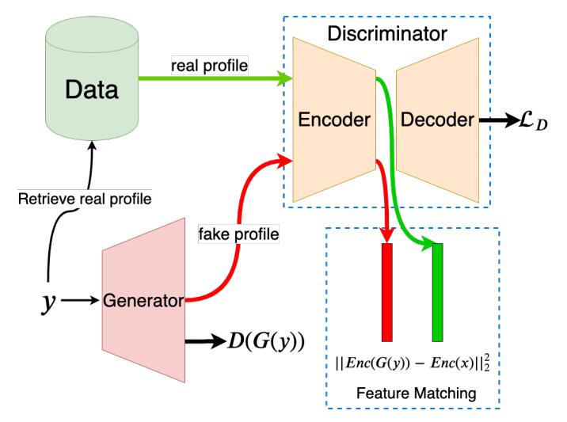

# GAN-based Matrix Factorization for Recommender Systems



This repository contains the code and experiments for the Master of Science thesis "GAN-based Matrix Factorization for Recommender Systems" at Politecnico di Milano. The abstract is provided below. Full text is available at http://hdl.handle.net/10589/154120.

## Abstract
The last decade has seen an exponential increase in the amount of available information thanks to the ever-growing number of connected devices and interaction of users with online content like social media, e-commerce, etc. While this translates in more choices for users given their diverse set of preferences, it makes it difficult for them to explore this vast amount of information. Recommender systems (RS) aim to alleviate this problem by filtering the content offered to users by predicting either the rating of items by users or the propensity of users to like specific items. The latter is known as Top-N recommendation in the RS community and it refers to the problem of recommending items to users, preferably in the order from most likely-to-interact to least likely-to-interact.

RS use two main approaches for providing recommendations to users; collaborative filtering and content-based filtering. One of the main algorithms used in collaborative filtering is matrix factorization which constitutes in estimating the user preferences by decomposing a user-item interaction matrix into matrices of lower dimensionality of latent features of users and items.

The burst of big data has triggered a corresponding response in the machine learning community in trying to come up with new techniques to extract relevant information from data. One such technique is Generative Adversarial Nets (GAN) proposed in 2014 by Goodfellow et al. which initiated a fresh interest in generative modelling. Under this modelling paradigm, GANs have shown great results in estimating high-dimensional, degenerate distributions in Computer Vision, Natural Language Processing and various other scientific fields. Despite their popularity and abilities in learning arbitrary distributions, GANs, and more generally generative modelling, have not been widely applied in RS.

In this thesis we investigate a novel approach that estimates the user and item latent factors in a matrix factorization setting through the application of Generative Adversarial Networks for generic Top-N recommendation problem. We detail the formulation of this approach and show its performance through different experiments on well know datasets in the RS community.

## How to use this repo
This repo is based on a version of the repo [Recsys_Course_AT_PoliMi](https://github.com/MaurizioFD/RecSys_Course_AT_PoliMi). In order to run the code and experiments you need first to setup a Python environment. Any environment manager will work but we suggest `conda` since it is easier to recreate our environment if using a GPU. `conda` can help with the installation of `CUDA` and `CUDA toolkit` necessary to utilize available GPU(s). We highly recommend running this repo with a GPU since GAN-based recommenders require long running times.

### Conda
Run the following command to create a new environment with `Python 3.6.8` and install all requirements in file `conda_requirements.txt`:

```shell
conda create -n <name-env> python==3.6.8 --file conda_requirements.txt
```

The file `conda_requirements.txt` also contains the packages `cudatoolkit==9.0` and `cudnn==7.1.2` which are installed completely separate from other versions you might already have installed and are managed by `conda`.

Next install the following packages using `pip` inside the newly created environment since they are not found in the `main` channel of `conda` and `conda-forge` channel holds old versions of them:

```shell
pip install scikit-optimize==0.7.2 telegram-send==0.25
```

Activate the newly created environment:

```shell
conda activate <name-env>
```

### Virtualenv & Pip
First download and install Python 3.6.8 from [python.org](python.org). Then install `virtualenv`:

```shell
python -m pip install --user virtualenv
```

Now create a new environment with virtualenv (by default it will use the Python version it was installed with):

```shell
virtualenv <name-env> <path-to-new-env>
```

Activate the new environment with:

```shell
source <path-to-new-env>/bin/activate
```

Now install the required packages through the file `pip_requirements.txt`:

```shell
pip install -r pip_requirements.txt
```

Note that if you intend to use a GPU and install required packages using `virtualenv` and `pip` then you need to install separately `cudatoolkit==9.0` and `cudnn==7.1.2` following instructions for your GPU on [nvidia.com](nvidia.com).

## Code organization

Before running any experiment or algorithm you need to compile the Cython code part of some of the recommenders. 
You can compile them all with the following command:

```python
python run_compile_all_cython.py
```

*N.B* You need to have the following packages installed before compiling: `gcc` and `python3-dev`

### Running single algorithms
We have provided python scripts to test-run only the GAN-based algorithms. They can be ran by:
```shell
python run_GANMF.py
python run_CFGAN.py
```

By default they download MovieLens100K dataset, split it into train-test-validation sets with ratio 6-2-2 and have reasonable default hyperparameters for both algorithms for this dataset.

### Running experiment 1: comparison with baselines
In order to run all the comparisons with the baselines use the file `RecSysExp.py`. First compute for each dataset 5 mutually exclusive sets:

* Training set: once best hyperparameters of the recommender are found, it will be finally trained with this set.

  * Training set small: the recommender is first trained on this small training set with the aim of finding the best hyperparameters
  * Early stopping set: validation set used to incorporate early stopping in the hyperparameters tuning.
  * Validation set: the recommender with the current hyperparameter values is tested against this set.
* Test set: once the best hyperparameters are found, the recommender is finally tested with this set. The results presented are the ones on this set.

Compute the splits for each dataset with the following command:

```shell
python RecSysExp.py --build_datasets
```

To run the tuning of a recommender use the following command:

```shell
python RecSysExp.py <recommender-name> [--item | --user] [--run_all | <dataset-name(s)>] [--no_mp]
```

* `recommender-name` is a value among: `Random, PureSVD, ALS, BPR, SLIMBPR, CFGAN, GANMF, DisGANMF, DeepGANMF, fullGANMF`.

* `item | user` is a flag used only for GAN-based recommenders. It denotes the item/user based training procedure for the selected recommender.

* `run_all` is a flag that selects all datasets on which to tune the selected recommender. If this flag is selected `dataset-name(s)` is neglected.

* `dataset-name(s)` is a value among: `LastFM, CiaoDVD, Delicious, 100K, 1M`. Multiple values can be set separated by space.

* `no_mp` is a flag that explictly requests no parallelism during tuning (each dataset tuned in parallel through Python's `multiprocessing` module). This flag is necessary for GAN-based algorithms running on a GPU in order not to exhaust the available GPU memory by constructing parallel Tensorflow graphs. It can be ommited for other baselines.

All results, best hyperparameters and dataset splits are saved into the directory `experiments`.


### Running experiment 2: Ablation study
In order to run the ablation studies use the script in `AblationStudy.py`. This file implements two functions: `ablation_study` and `feature_matching_cos_sim`. In order to run it, modify the very last line with the name of any of the above functions:

```shell
python AblationStudy.py [--run-all | <dataset-name(s)>] [item | user]
```

* `run-all` is a flag that asks for the computation of the experiment on all datasets. If it is set, `dataset-name(s)` is neglected.

* `dataset-name(s)` is a value among: `LastFM, CiaoDVD, Delicious, 100K, 1M`. Multiple values can be set separated by space.

* `item | user` is a flag that sets the training procedure for `GANMF` recommender.

Results for function `ablation_study` are saved in directory `ablation_study` and results for `feature_matching_cos_sim` are saved in directory `cosine_similarities`. This experiment must be run after tuning `GANMF` since the best hyperparameters are retrieved from `experiments` directory.


### Testing on test set with best hyperparameters
In order to test each tuned recommender on the test set (which is created when tuning the hyperparameters) run the following command:

```shell
python RunBestParameters.py <recommender-name> [train-mode] [--run-all | dataset-name(s)]
```

* `recommender-name` is a value among: `Random, PureSVD, ALS, BPR, SLIMBPR, CFGAN, GANMF, DisGANMF, DeepGANMF, fullGANMF`.

* `train-mode` is a value among: `item, user`. It specifies the training procedure for GAN-based recommenders. If omitted for GAN-based recommenders both training procedures are run. It is omitted for other baselines.

* `run-all` is a flag that asks for the computation of the experiment on all datasets. If it is set, `dataset-name(s)` is neglected.

* `dataset-name(s)` is a value among: `LastFM, CiaoDVD, Delicious, 100K, 1M`. Multiple values can be set separated by space.
